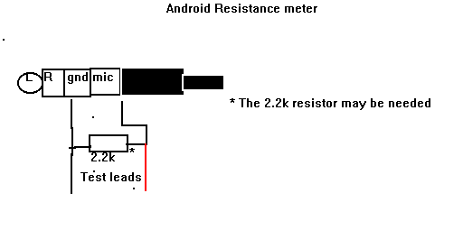

# ohmdroid
An android ohm meter based on macrodroid and headset buttons

1. To use it download the free or pro version of macro droid
2. https://play.google.com/store/apps/details?id=com.arlosoft.macrodroi
3. Upload the mdr file to the android device
4. try shorting the test leads and see if you get a black testbox sayung 70 or less.
5. When done disable all macros.

To learn more visit https://source.android.com/docs/core/interaction/accessories/headset/jack-headset-spec

Get the following parts from all electronics: 
* 1x 2.2k resistor any wattage https://www.allelectronics.com/item/291-2.2k/2.2k-ohm-1/4-watt-resistor/1.html
* 1x 4-pin 3.5mm to 3-rca https://www.allelectronics.com/item/cb-218/camcorder/ipod-video-av-cable/1.html
* And something to figure out the pinout

You will need to cut and solder to the cord.

Schematic: 

NOTE: Some ranges work after being disconnect from the resistor under test or holded on there and released
